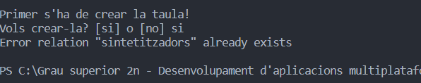
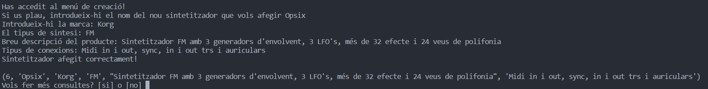
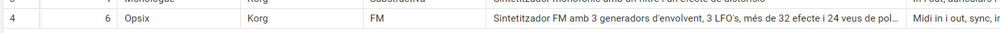
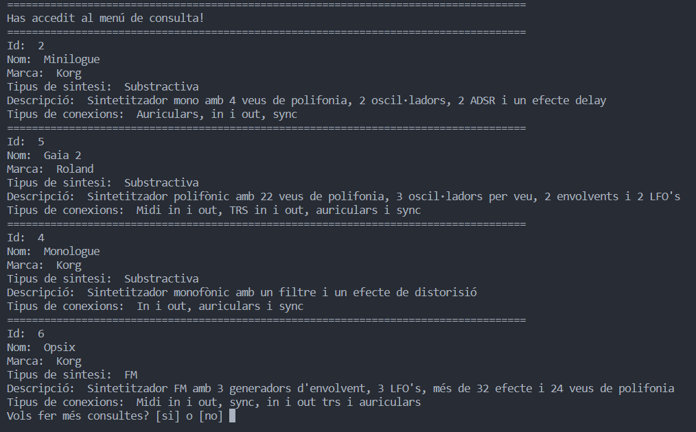
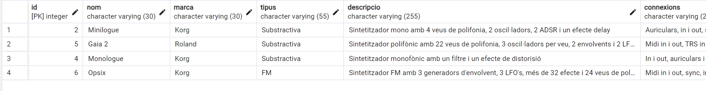
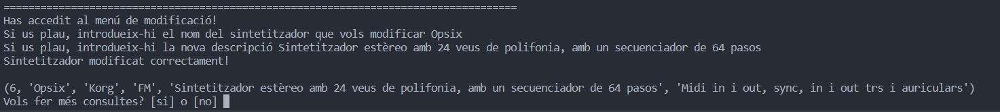
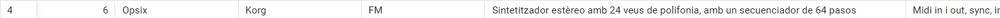
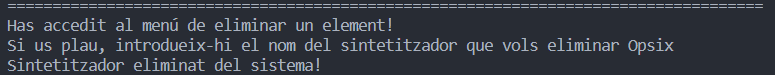
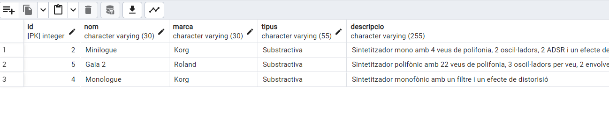

# **Pràctica 2 - CRUD amb PostgreSQL**

### **CrearTaula**:

* El primer mètode que s'utilitzarà és el de "crearTaula", com la taula ja esta creada, ens sortirà això per terminal:

  

---

### Crear:

* El segon mètode és el d'afegir un element, en aquest cas un sintetitzador, a la base de dades.

---

* I fem la comprovació a pgAdmin:

---

### Consultar:

* El tercer mètode ens retorna tots els elements de la base de dades:

* dins pgAdmin:

---

### **Modificar:**

* El quart element modificar la descripció de l'element que vulguis.

* Comprovació de la modificació a pgAdmin:

---

### **Eliminar:**

* El cinquè mètode consisteix en eliminar un element de la base dades pasant-li el nom.

* Fem la comprovació a la pàgina pgAdmin.

